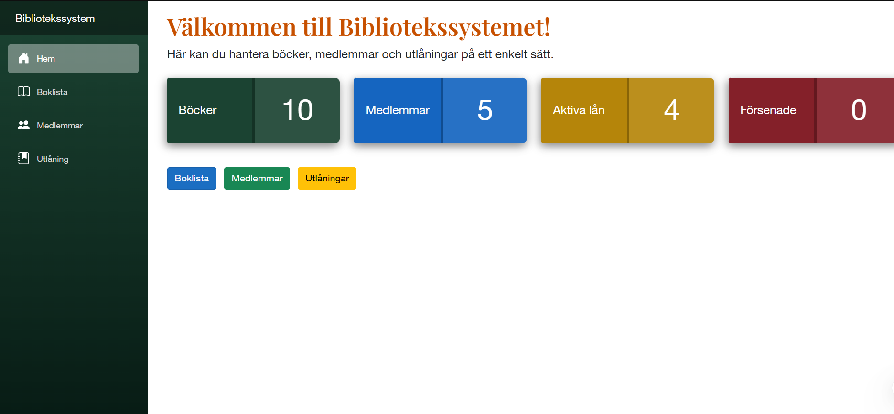
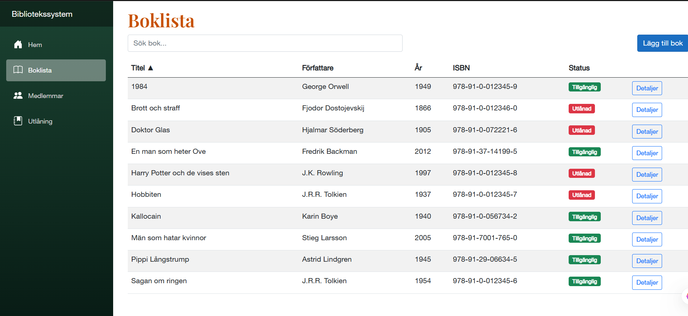
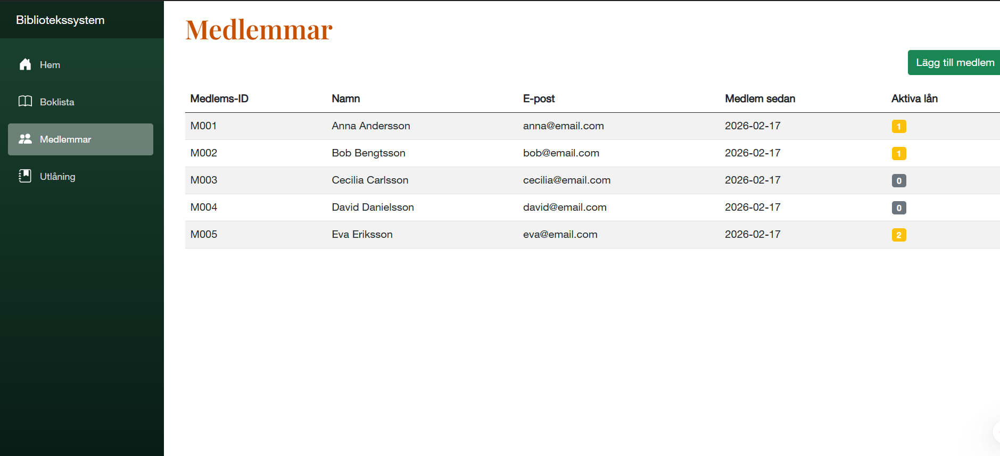
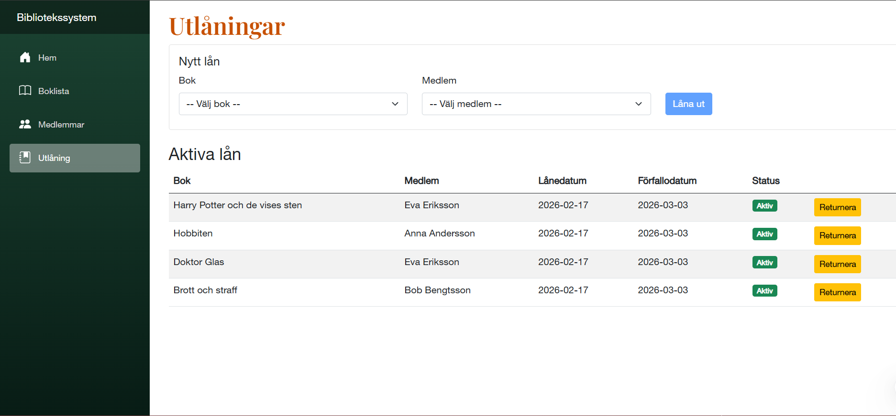

# LibrarySystem

Detta projekt är ett bibliotekssystem utvecklat i C# inom ramen för
**Individuell Inlämningsuppgift – Del 1 & Del 2**.

- **Del 1:** OOP, Arv/Komposition & Algoritmer
- **Del 2:** Entity Framework Core & Blazor

------

## Funktionalitet

### Konsolapplikation (Del 1)
Via en konsolbaserad meny kan användaren:
- Visa och söka böcker (titel, författare, ISBN)
- Låna och returnera böcker
- Visa medlemmar
- Visa statistik (antal böcker, utlånade böcker, mest aktiva låntagare)
- Visa försenade lån och beräkna förseningsavgifter

### Webbapplikation (Del 2)
Via ett Blazor Server-gränssnitt kan användaren:
- Visa alla böcker i en tabell med sortering och sökning
- Lägga till nya böcker
- Visa bokdetaljer
- Hantera medlemmar
- Hantera utlåning

------

## Designval

### Del 1 – Komposition
Projektet använder **komposition** enligt alternativ B i uppgiften.

Ett `Library`-objekt ansvarar för att samordna:
- `BookCatalog` – hantering av böcker
- `MemberRegistry` – hantering av medlemmar
- `LoanManager` – hantering av utlåning

Sökfunktionalitet implementeras via interfacet `ISearchable` för polymorf sökning.

### Del 2 – Entity Framework Core & Blazor
- **Entity Framework Core** med SQLite för datalagring
- **Repository pattern** för dataåtkomst (`IBookRepository`, `IMemberRepository`, `ILoanRepository`)
- **Blazor Server** för webbgränssnittet med interaktiva komponenter
- **Seed data** – 10 böcker och 3 medlemmar läggs in automatiskt vid uppstart

---

## Projektstruktur

- **LibrarySystem.Core** – Domänmodeller och affärslogik (Models, Services)
- **LibrarySystem.Data** – Dataåtkomst med EF Core (LibraryContext, Repositories)
- **LibrarySystem.Web** – Blazor Server webbapplikation
- **LibrarySystem.Console** – Konsolapplikation (meny och användarinteraktion)
- **LibrarySystem.Tests** – Enhetstester med xUnit, EF Core InMemory och bUnit

---

## Köra applikationen

### Konsol (Del 1)
```bash
dotnet run --project LibrarySystem.Console
```

### Webb (Del 2)
```bash
dotnet run --project LibrarySystem.Web
```
När terminalen visar `Now listening on: http://localhost:5009`, öppna din webbläsare och gå till:
```
http://localhost:5009
```

---

## Hämta projektet

```bash
git clone https://github.com/AigennA/LibrarySystem.git
```

Öppna sedan `LibrarySystem.sln` i Visual Studio.

---

## Tester

Projektet innehåller **60 enhetstester** (minimikrav: 10).

### Testöversikt
| Kategori | Antal | Beskrivning |
|----------|-------|-------------|
| BookTests | 4 | Konstruktor, tillgänglighet, GetInfo, validering |
| LoanTests | 5 | IsOverdue, IsReturned, ReturnBook, undantag |
| MemberTests | 3 | Konstruktor, aktiva lån, sökning |
| LateFeeTests | 3 | Förseningsavgifter och lånesammanfattning |
| LibraryTests | 8 | AddBook, BorrowBook, ReturnBook, sökning, sortering |
| LibraryStatisticsTests | 4 | Statistik och sortering |
| SearchTests | 2 | ISearchable med Theory-tester |
| LoanEdgeCaseTests | 5 | Null-kontroller, datumvalidering, edge cases |
| BookRepositoryTests | 7 | EF Core InMemory – CRUD och sökning |
| LoanRepositoryTests | 3 | EF Core InMemory – aktiva/försenade lån |
| MemberRepositoryTests | 3 | EF Core InMemory – CRUD |
| BookCardTests | 3 | bUnit – Blazor-komponenttester |

### Köra tester
```bash
dotnet test
```
Eller via Test Explorer i Visual Studio.
Testresultat:
```
Passed!  - Failed: 0, Passed: 60, Skipped: 0, Total: 60
```

---

## Databasschema

Databasen består av tre tabeller med följande struktur och relationer:

```
┌─────────────────────────┐        ┌──────────────────────────────┐
│         Books           │        │           Loans              │
├─────────────────────────┤        ├──────────────────────────────┤
│ Id           INT (PK)   │◄───────│ Id           INT (PK)        │
│ ISBN         TEXT UNIQUE│        │ BookId       INT (FK)        │
│ Title        TEXT(200)  │        │ MemberId     TEXT (FK)       │
│ Author       TEXT(100)  │        │ LoanDate     DATETIME        │
│ PublishedYear INT       │        │ DueDate      DATETIME        │
│ IsAvailable  BOOL       │        │ ReturnDate   DATETIME (null) │
└─────────────────────────┘        └──────────────────────────────┘
                                              │
┌─────────────────────────┐                  │
│        Members          │                  │
├─────────────────────────┤                  │
│ MemberId     TEXT (PK)  │◄─────────────────┘
│ Name         TEXT(100)  │
│ Email        TEXT(100)  │
│ MemberSince  DATETIME   │
└─────────────────────────┘
```

### Relationer
- **Books → Loans**: En bok kan ha många lån (one-to-many)
- **Members → Loans**: En medlem kan ha många lån (one-to-many)
- **DeleteBehavior**: Restrict – böcker och medlemmar kan inte tas bort om aktiva lån finns

### Konfiguration (LibraryContext)
- `ISBN` är unikt indexerat
- `MemberId` är primärnyckel i Members (sträng-ID, t.ex. `M001`)
- `ReturnDate` är nullable – null betyder att boken inte har returnerats än

---

## Screenshots

### Startsida


### Böcker


### Medlemmar


### Lån

